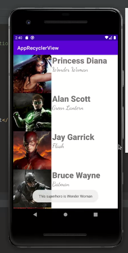
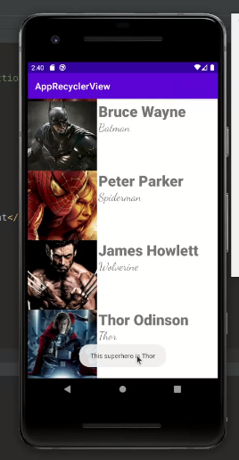

# kotlin-app-recycler-view

## Resources:books:

* [Tutorial Recicler-view](https://cursokotlin.com/capitulo-15-recyclerview-kotlin/)
---

*** Note: Please, remember use these pluggins in the file build.gradle:

```
plugins {
    id 'com.android.application'
    id 'kotlin-android'
    id 'kotlin-android-extensions'
}
```
---

## Images






## Author
* **Daniela Ramirez Gomez** - [danyramirezg](https://github.com/danyramirezg)
